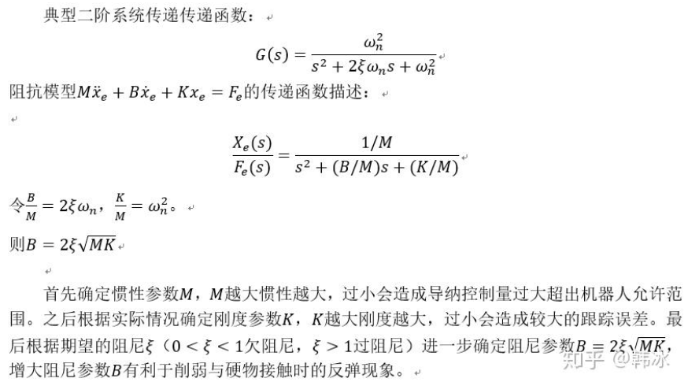

# 导纳控制概述

通过六维传感器得到机械臂末端执行器受到的力，经过导纳二阶模型计算出需要修正的位移量，叠加到原本的期望位移量上，从而实现对机械臂的柔顺控制

# 导纳二阶模型

$$
F_{e} = M \ddot{x}_{e} + B \dot{x}_{e} + K x_{e}
$$
其中，$F_{ex}$为外部力，$M$为惯性系数对角矩阵，$B$为阻尼系数对角矩阵，$K$为刚度系数对角矩阵，$x_{ex}$为导纳模型输出的附加位移

# 导纳模型的计算

设实际位姿为$x$
位置控制时的期望位姿为$x_d$

$$
x_{e}^t = x^t - x^t_{d}\\
\dot{x}_{e}^t = \dot{x}^t - \dot{x}^t_{d}\\
$$
$$
\ddot{x}_{e}^{t+1} = M^{-1} (F_{e} - B \dot{x}_{e}^t - K x_{e}^t)
$$

进一步积分可得

$$
\dot{x}_{e}^{t+1} = \dot{x}_{e}^t + \ddot{x}_{e}^{t+1} \Delta t\\
x_{e}^{t+1} = x_{e}^t + \dot{x}_{e}^{t+1} \Delta t
$$

将$x_{e}^{t+1}$叠加到原本的期望位姿$x_d$上，得到修正后的期望位姿

# 参数整定

