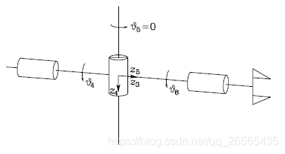
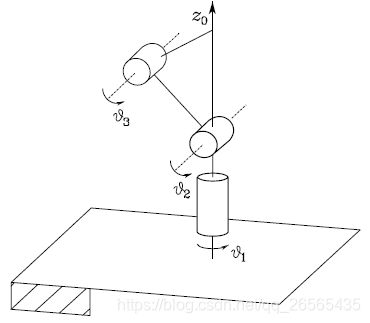
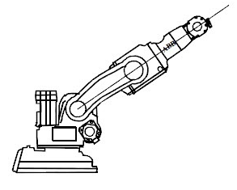
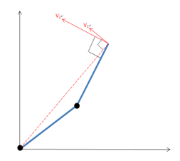
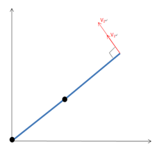

# 机械臂奇异点

机械臂奇异位形指的是使得机械臂**雅可比矩阵非满秩**的的位形

## 机械臂奇异点的严重后果

- 机械臂自由度缺失
- 机械臂逆运动学解出现无穷解
- 接近奇异位形时，操作空间的微小速度变化可能会导致关节空间出现很大的速度

# 机械臂奇异点的分类

## 腕部奇异位形

关节4和关节6同时以相反的速度旋转时，末端执行器位置不会发生改变

## 肩部奇异位形

末端执行器roll轴与关节1旋转轴重合时，关节1旋转并不会使得末端执行器位置改变

## 肘部奇异位形

当两旋转轴不共线时，可以通过改变速度大小得到任意方向的速度；当两旋转轴共线时，两旋转轴传递到末端执行器的速度方向相同，能够得到的速度方向受限